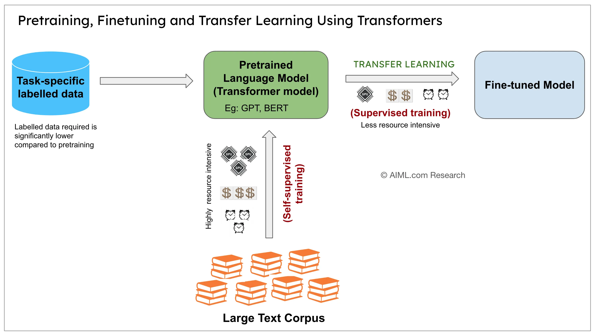
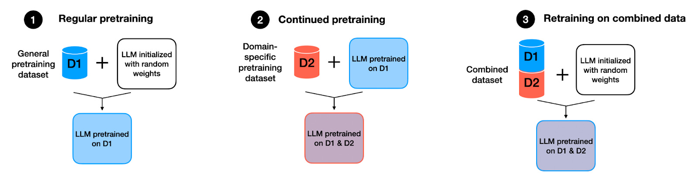
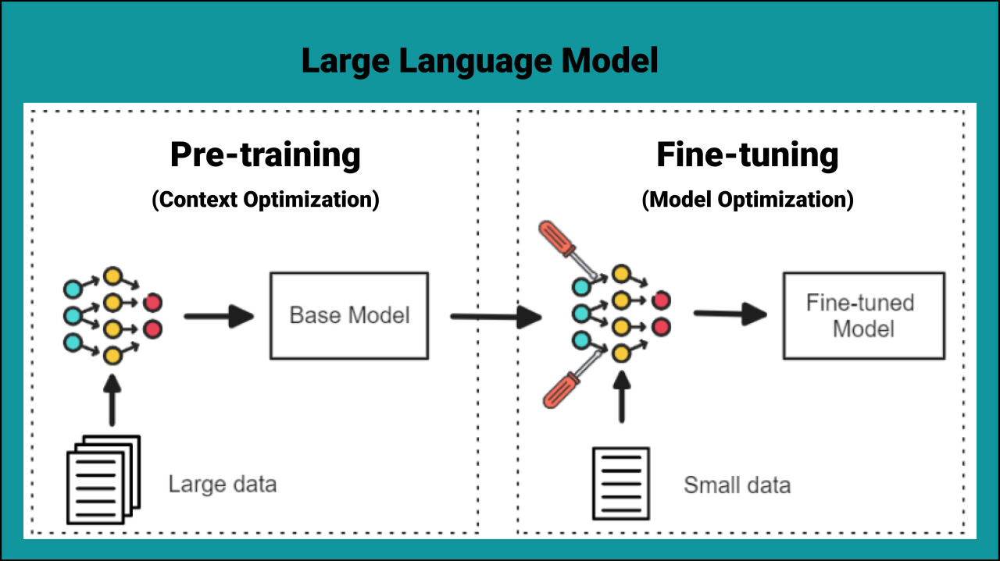
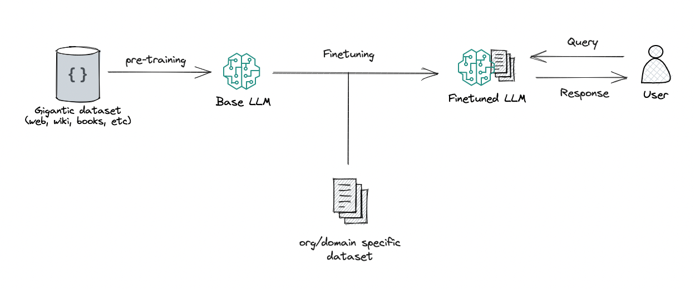
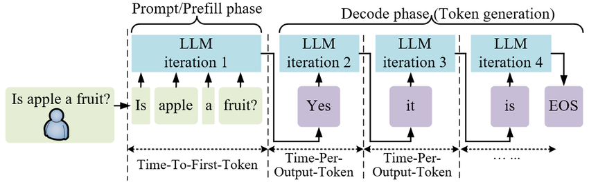

If you’ve used ChatGPT-like tools, you’ve probably wondered: how does a machine produce answers that *sound* so human?

It’s tempting to think an LLM is “thinking” behind the scenes. But the real story is more practical—and more interesting.

An LLM doesn’t wake up intelligent. It goes through a lifecycle: it’s built, trained, refined, and finally served to users at scale.
<!--truncate-->

<b>FIG 1:</b> A simple view of an LLM lifecycle

## 1. What Are Large Language Models (LLMs)?

In one sentence:

**Large Language Models (LLMs) are AI systems trained to understand and generate human-like text.**

That sounds magical, so it helps to be clear about what they *don’t* do:

- They don’t **think** the way humans do.
- They don’t **understand** meaning the way humans do.
- They’re incredibly good at recognizing **patterns in language**.

A helpful analogy is: an LLM is like someone who has read a huge chunk of the internet (books, articles, forums, code), and can continue a piece of text in a way that statistically fits.

It’s not “a mind.” It’s a very large pattern-learning system.

## 2. Why Do LLMs Need a “Lifecycle”?

Humans learn in stages:

- We absorb language over years.
- We practice.
- We get corrected.
- We learn what’s appropriate in different contexts.

LLMs also need stages. You can’t jump straight to “being helpful” without building foundations.

One simple way to think about it is:

**Born → educated → trained → deployed**

The next sections walk through that journey without heavy math.

## 3. Step 1: Gathering the Raw Material — Data

LLMs are trained on large collections of text, such as:

- books
- articles
- websites
- code

Two things matter a lot here:

- **Quantity**: more exposure helps the model learn more patterns.
- **Quality**: clean, diverse, and well-curated data generally produces better results.

One important clarification:

**LLMs don’t “store” documents like a search engine.**

Instead, they learn general patterns from the data.

An analogy: it’s like reading millions of books and becoming good at writing and summarizing—without memorizing exact sentences to quote on demand.

## 4. Step 2: Pre-Training — Learning Language from Scratch

Pre-training is where the model learns the basics of language:

- grammar and sentence structure
- which words tend to appear together
- how paragraphs flow
- patterns across many writing styles

### Next-word prediction (plain English)

At its core, pre-training often looks like this:

You give the model some text, and it learns to predict what comes next.

If you type:

“The cat sat on the”

…a model that has seen lots of language will guess something like “mat” is likely.

Scale that up across massive datasets, and the model becomes surprisingly capable.

But here’s the key idea:

**Pre-training teaches how language works, not how to behave.**

So a pre-trained model might be great at completing text, but not automatically great at being safe, accurate, or helpful.

<b>FIG 2:</b> Pre-training builds the language foundation

## 5. Step 3: Fine-Tuning — Learning to Be Useful

After pre-training, a model often needs refinement to become the assistant-like tool people expect.

### Instruction Fine-Tuning

This stage teaches the model to behave more like a helpful assistant:

- answer questions more directly
- follow prompts and instructions
- stay on topic
- format responses clearly

You can think of it as: “Okay, you learned language. Now learn how to use it in a helpful way.”

### Human Feedback & Safety

Another common refinement step involves humans evaluating outputs.

Humans might rate multiple answers and indicate which one is:

- more helpful
- more accurate
- less harmful
- safer and more appropriate

The model then learns to prefer the better behaviors.

An analogy: after years of self-study, a coach helps you correct bad habits and practice the kind of responses people actually need.

<b>FIG 3:</b> Pre-training vs fine-tuning (conceptual)

<b>FIG 4:</b> Fine-tuning shapes the model into an assistant

## 6. Step 4: Inference — When You Talk to the Model

Inference is the “live” phase: the model is deployed, and you interact with it.

When you type a prompt, the model:

1. looks at your text
2. predicts the next word (more precisely: the next small chunk of text)
3. adds it to the response
4. repeats this many times until it finishes

This happens fast, but it’s still the same idea: **predict the next piece of text, over and over**.

### Myth-busting: does it learn from your message?

Usually, no.

In most deployments, your chat message does not instantly “train” the model.

What you’re interacting with is typically a **frozen** model: its knowledge and behavior are set by training done earlier. (Some systems may log data for future improvements, but that’s not the same as instant learning inside your conversation.)

<b>FIG 5:</b> Inference is the live prediction loop

## 7. Where High Performance Computing (HPC) Fits In

If the lifecycle so far sounds expensive—you’re right.

Training LLMs is not something a single computer can realistically do at modern scales.

### Why training needs HPC

Training typically requires:

- **thousands of GPUs** working in parallel
- **massive memory** to hold model parameters and training state
- **weeks or months** of computation
- reliable storage and fast networking to keep all the machines coordinated

Even fine-tuning and inference benefit from the same HPC ideas:

- **speed** (people expect low latency)
- **scale** (many users at once)
- **reliability** (services must stay up)

That’s why it’s fair to say:

**Modern LLMs are basically impossible without HPC.**

Whether it’s a supercomputer in a research center or a large GPU cluster in a data center, the challenges are similar: performance, coordination, power usage, and cooling.

## 8. Why Understanding This Matters

Knowing the lifecycle helps you use AI more wisely.

For individuals, it helps you:

- trust AI appropriately (it can be useful without being “a mind”)
- understand limitations (it can be confidently wrong)
- write better prompts (you’re steering a text generator, not querying a database)

For society, it helps us:

- ask better questions about how these systems should be built and deployed
- demand safer behavior and clearer accountability
- avoid treating AI as magic

LLMs aren’t magic — they’re engineered systems built in stages.

And once you see those stages clearly, the technology becomes less mysterious—and easier to evaluate.
